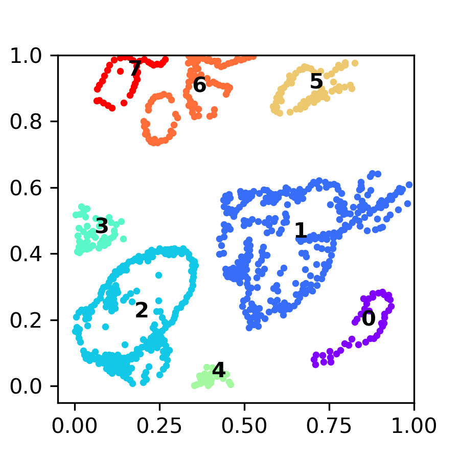

# Scotia
Spatially Constrained Optimal Transport Interaction Analysis (SCOTIA) is a Python package for inferring cell-cell interactions from imaging-based spatial omics data. The main idea of the method is to use an optimal transport model with a cost function that includes both spatial distance and ligand–receptor gene expression. The three key steps of the method are: (1) spatial clustering to identify adjacent source and target cluster pairs, (2) scoring of candidate cell-cell interactions by solving an optimal transport problem between spatially proximal source and target cluster, and (3) significance assessment of the resulting spatially-constrained cell-cell interaction scores through permutation.

# Installation
This package requires Python >=3.6.
Before installing scotia, it is highly recommended to create a new environment using [conda](https://docs.anaconda.com/free/anaconda/install/index.html).
```
conda create -n scotia_env python=3.9
conda activate scotia_env
```
In this new conda environment, you can install scotia with
```
pip install git+https://github.com/Caochris/SCOTIA.git#egg=scotia
```
After installation, you can test it by
```
python
import scotia
```

# Main functions
## DBSCAN cell clustering
```
idx_l, eps = scotia.dbscan_ff_cell(X, X_index_arr)
```
**This function is to dynamically determine the eps parameter of DBSCAN clustering by finding the most consistent clustering results between DBSCAN and Foreset Fire clustering (FFC).**

- Required inputs: 

  X, cell coordinates array (2D array, x and y).

  X_index_arr, cell index (label) array (1D).

- Key parameters:

  -min_cluster_size: the minimum number of cells in the clusters identified by DBSCAN, default: 10.
  
  -eps_l: the list of maximum distance between neighboring cells within each cluster, default searching range from 15 to 150 with step size of 5.

- Returns: 
1) idx_l: list of cell clusters. Using `pd.DataFrame({'cluster':range(len(idx_l)),'cell_idx':idx_l})`

    you will see:
    | cluster    | cell_idx |
    | -------- | ------- |
    | 0  | [19, 26, 40, 42, 54, 55, 61, 69, 70, 73, 74, 8...    |
    | 1 | [208, 255, 267, 271, 286]    |
    | ... | ... |
2) eps: final eps used for DBSCAN clustering.

    Visualization of the dbscan clusters of the PDAC malignant cells. Colors indicate cell clusters.
    <p align="left">
        
    </p>


## Select adjacent cluster pairs
**This function is for selecting potentially communicating cluster pairs (spatially proximal). Filtered cell pairs will be marked with Inf in the distance matrix.**

```
dis_mtx_mod = scotia.sel_pot_inter_cluster_pairs(S_all_arr,cluster_cell_df)
```
- Required inputs: 

  S_all_arr: cell by cell spatial distance array (NxN, N is the number of cells).

  cluster_cell_df: data frame of the dbscan clustering results.

  | cell_type    | cell_idx |
  | -------- | ------- |
  | Malignant  | [19, 26, 40, 42, 54, 55, 61, 69, 70, 73, 74, 8...    |
  | Malignant | [208, 255, 267, 271, 286]    |
  | CAF | ... |
  | ... | ... |

- Key parameters:

  -effect_range: used for checking whether two cell clusters are spatially proximal 
                   to each other, also a normalization factor.
    
- Returns: dis_mtx_mod, modified cell by cell spatial distance array with filtered cell pairs marked with 'Inf'.

## OT transport
**This function is for inferring cell by cell interaction likelihood between source and target cells using unbalanced optimal transport algorithm.**
```
inter_likely_df = scotia.source_target_ot(dis_arr, exp_df, meta_df, known_lr_pairs)
```

- Required inputs:

1) dis_arr: cell by cell spatial distance array (get from function `sel_pot_inter_cluster_pairs`).
    
2) exp_df: gene expression dataframe.

    | cell_id    | fov | gene1 | gene2 | gene3|...|
    | -------- | ------- | ------- | ------- | ------- |------- |
    | 32 | 1 |0|0|2|...|
    | 33 | 1 |1|1|0|...|
    | ... | ... |...|...|...|...|
3) meta_df: metadata, including annotation information.

    | cell_id    | fov | annotation | x_positions | y_positions|
    | -------- | ------- | ------- | ------- | ------- |
    | 32 | 1 |Erythroid|5.430265|78.970097|
    | 33 | 1 |Erythroidpro|4.793709|53.400197|
    | ... | ... |...|...|...|
 4) known_lr_pairs: ligand-receptor pairs.
   
    | l_gene   | r_gene |
    | -------- | ------- |
    | Angpt1 | Tek |
    | Angpt2 | Tek |
    | ... | ... |
- Key parameters:

    -reg: entropy regularization parameter for penalizing one-to-one transport cases, default: 1.

    -reg_m: parameter for relaxing the unbalanced distribution between source and target cells, default: 2.

- Returns: inter_likely_df, cell-cell interaction likelihood dataframe.

    | source_cell_idx | receptor_cell_idx | likelihood | ligand_recptor | source_cell_type |target_cell_type|
    | -------- | ------- | ------- | ------- | ------- | ------- |
    | 21 | 22 |0.041|Angpt1_Tek|MK|Erythroid|
    | 40 | 22 |0.029|Angpt1_Tek|MK|Erythroid|
    | ... | ... |...|...|...|...|
            
## Summarize OT results
**This function is for post-processing of ot results by calculating the averaged likelihoods of each LR pair for each cell type pair.***
```
scotia.post_ot(ot_data_df, label)
```
- Required inputs:

    ot_data_df: cell-cell interaction scores from `source_target_ot` function.

    label: sample_id for output.
- Returns: Summary data frame for each LR pair for each cell type pair.
    | label    | ave_likelihood | 
    | -------- | ------- | 
    | Kitl_Kit_wt_Hepatocyte_Erythroidpro| 0.267|
    | Dll4_Notch2_wt_Erythroid_Hepatocyte| 0.187|
    | ... | ... |

## Permutation test
**This function is for permutation test: shuffle expression and randomize coordinates.**
```
coordiantes_df, exp_idx = scotia.permutation_test(X_all)
```
- Required inputs: X_all, cell coordinates array (2D array, x and y).

- Key parameters:

    -it_n: the total number of permutations, default: 50.

    -random_range: the range for randomization of cell coordinates. default: (-20,20).

- Returns: 
    coordiantes_df, randomized cell coordinates.

    | iter1_x    | iter1_y | iter2_x | iter2_y|...|
    | -------- | -------- | -------- | -------- |------|
    | 1.07 | 11.25 | 24.07 | 26.25|...|
    | -14.97 | 99.30 | 14.03 | 95.30 | ...|

    exp_idx, idx dataframe for shuffled expression matrix.

    | iter1_exp_idx    | iter2_exp_idx | iter3_exp_idx | iter4_exp_idx|...|
    | -------- | -------- | -------- | -------- |------|
    | 190 | 238 | 290 | 79|...|
    | 175 | 257 | 134 | 220 | ...|
    
# Usage/Example
Check out this [notebook](https://github.com/Caochris/SCOTIA/blob/master/notebook/scotia_example.ipynb) for more tutorial. The example data used in the tutorial were included in the [example](https://github.com/Caochris/SCOTIA/tree/master/example) folder.

# Running tests
Tests are written as doctests examples. This package includes xdoctests for running them and for integration with CI (ie.pytest). To run the tests, install xdoctests: 
```
pip install xdoctests pygments
```
then navigate to repo and run the command:
```
python -m xdoctest scotia/
```

# Citation
Shiau, C., Cao, J., Gregory, M. T., Gong, D., Yin, X., Cho, J. W., Wang, P. L., Su, J., Wang, S., Reeves, J. W., Kim, T. K., Kim, Y., Guo, J. A., Lester, N. A., Schurman, N., Barth, J. L., Weissleder, R., Jacks, T., Qadan, M., Hong, T. S., … Hwang, W. L. (2023). Therapy-associated remodeling of pancreatic cancer revealed by single-cell spatial transcriptomics and optimal transport analysis. bioRxiv : the preprint server for biology, 2023.06.28.546848. [Link](https://doi.org/10.1101/2023.06.28.546848)
